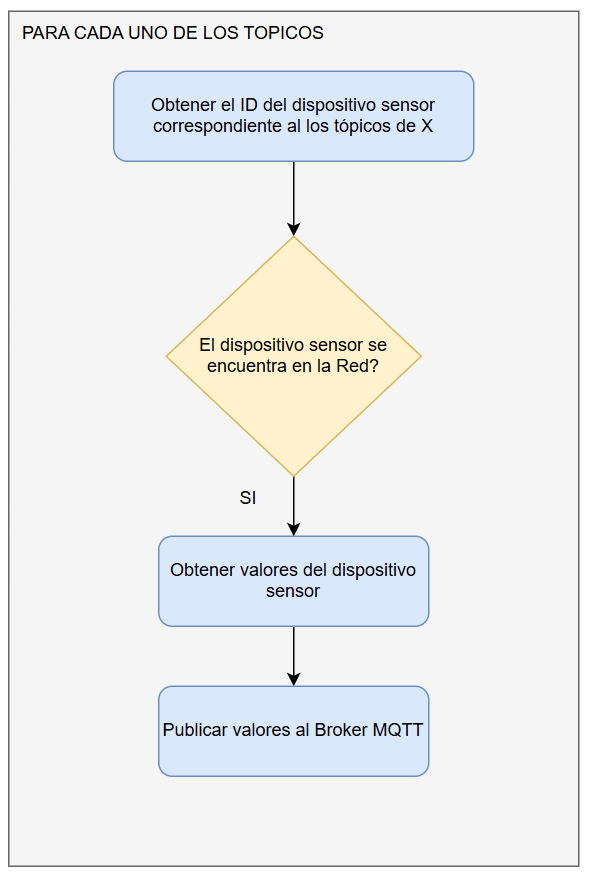

# Sistema de monitoreo y gestión remota de invernaderos - Gateway
Proyecto realizado dentro del marco del Trabajo Profesional de Ingeniería Eletrónica de la Facultad de Ingeniería de la Universidad de Buenos Aires

## Contenido 
Este repositorio contiene el firmware del dispositivo del gateway del sistema.

## Características del Hardware
- Microcontrolador: ESP32-C3-WROOM-02 de la empresa [Espressif](https://www.espressif.com/)
- Framework: ESP-IDF

## Comunicación de Datos

### Bluetooth

El dispositivo gateway usa Bluetooth 5.0 BLE Mesh para la comunicación con los dispositivos [esp32c3-sensor](https://github.com/matiasvinas/esp32c3-sensor). El dispositivo gateway actúa como provisionador de la red de los dispositivos sensores. Para que un dispositivo sensor pueda ser provisionado a la red deberá contener valores espefícos los primeros 16 bits del UUID.

Cada dispositivo sensor cuenta con un ID que lo distingue del resto de los dispositivos. Cada ID tiene asignado un TDA con los tópicos relacionados a sus variables.

### MQTT

El dispositivo gateway actua como MQTT Client e interactua con el MQTT Broker de OpenRemote. Se utiliza el puerto 8883 (Conexión Segura).

## Identificación de los dispositivos sensores y asignación de los tópicos correspondientes

El dispositivo gateway identifica primero si el dispositivo sensor "A" se encuentra dentro de la Red. En caso de ser cierto, obtiene los valores mediante Bluetooth y los envía al Broker MQTT. Luego realiza el mismo procedimiento con el resto de los dispositivo sensores. 

## Notas
- Para la conexión WIFI se utilizó la configuración de ejemplo del esp-idf framwork. Se la puede configurar en el archivo sdkconfig.
- Se creó una "custom partition table" y se modificó el el tamaño de memoria flash de 2MB a 4MB.

|Name|Type|Subtype|Offset|Size|
|----|----|-------|------|----|
|nvs |data|nvs    |0x9000|24K |
|phy_init|data|phy|0xf000|4K |
|factory|app|factory|0x10000|4M|

## Enlaces útiles

[ESP-BLE-MESH - Sensor Server Client Example](https://github.com/espressif/esp-idf/blob/master/examples/bluetooth/esp_ble_mesh/sensor_models/sensor_client/README.md)